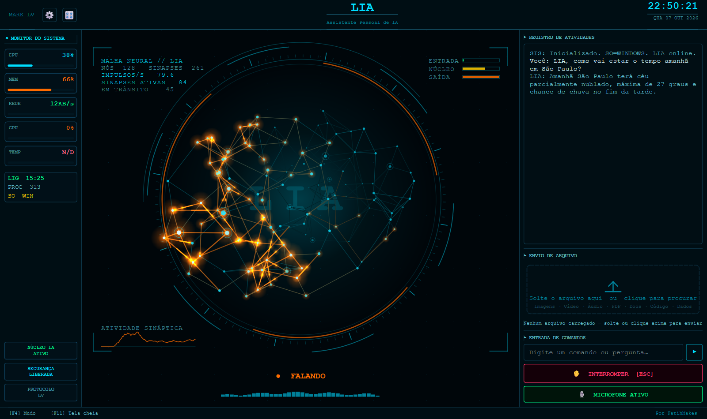

# 🧠 LIA — Tecnologia Neural

### Assistente de voz pessoal com HUD de rede neural, em português do Brasil



A LIA é uma assistente de voz em tempo real que ouve, vê, fala e controla o seu
computador. Ela conversa sempre em **português do Brasil**, e o centro da tela é
uma **rede neural 3D cujas sinapses pulsam conforme a conversa**.

O projeto é uma versão modificada do **[MARK LV — JARVIS](https://github.com/FatihMakes/Mark-LV)**, de
**[FatihMakes](https://www.youtube.com/@FatihMakes)**, sob a licença CC BY-NC 4.0.
Os detalhes do que mudou estão em [MODIFICACOES.md](MODIFICACOES.md).

---

## ✨ O que a LIA tem de novo

### 🧠 HUD de rede neural
No centro da tela fica uma malha 3D com 128 neurônios e cerca de 260 sinapses,
organizada em dois lobos como um cérebro. Ela gira devagar e cada pulso que corre
pelas sinapses é provocado por algo real da conversa:

| O que acontece | Como a rede reage |
|---|---|
| Você fala ou digita | Rajada **verde** no lobo de entrada; frases longas geram rajadas maiores |
| A LIA responde | Rajada **laranja** no lobo de saída, um disparo por palavra |
| A LIA está pensando | O núcleo dispara rápido em **âmbar** e a rede gira mais depressa |
| Volume da voz | O microfone alimenta a entrada; a voz da LIA alimenta a saída |
| Erro | Descarga **vermelha** pela rede toda |
| Microfone mudo | A rede escurece e quase para |

Ao redor ficam anéis giratórios e painéis de dados: impulsos por segundo,
sinapses ativas, atividade de cada lobo e um gráfico da atividade sináptica.
Tudo é desenhado em software, sem precisar de placa de vídeo.

Pelo botão 🎛 → **HUD**, dá para alternar entre a rede neural, o rosto animado
e o núcleo reator.

### 🇧🇷 Português do Brasil de ponta a ponta
- A LIA **sempre fala em pt-BR**, desde a primeira palavra da sessão, com
  vocabulário brasileiro.
- A interface inteira está traduzida: botões, painéis, configurações,
  registro de atividades e mensagens do sistema.

### 🤖 Integração com o Claude Code
Peça coisas como *"pede pro Claude criar um script que organize minhas fotos"*.
A LIA repassa a tarefa ao [Claude Code](https://claude.com/claude-code), que
trabalha em segundo plano no seu computador. Quando ele termina, a LIA conta o
resultado em voz alta e mostra o relatório completo na tela.

### 📁 Pastas no lugar certo
"Área de trabalho", "documentos", "downloads" e as outras pastas agora seguem o
local real do Windows, **inclusive quando o OneDrive faz backup delas**. Antes,
os arquivos iam parar numa pasta escondida que o Windows não mostra.

---

## 🚀 O que ela sabe fazer

| Recurso | Descrição |
|---|---|
| 🎙️ Voz em tempo real | Conversa com baixa latência pela API Gemini Live |
| 🖥️ Controle do computador | Abre programas, ajusta volume e brilho, Wi-Fi, atalhos e energia |
| 📂 Arquivos | Cria, move, renomeia, copia e organiza arquivos e pastas |
| 📄 Leitura de documentos | Lê, resume e responde perguntas sobre arquivos locais |
| 🌐 Navegador | Abre sites, navega entre abas e interage com páginas |
| 🔍 Pesquisa na web | Notícias, pesquisa, preços e comparações |
| 👁️ Visão | Enxerga a tela e a webcam quando você pede |
| 📺 Vídeo na HUD | Toca YouTube, arquivos locais ou links de vídeo no centro da tela |
| ⏰ Lembretes | Notificações agendadas pelo próprio sistema operacional |
| 🌤️ Clima | Previsão do tempo para a sua cidade |
| 📨 Mensagens | Envia mensagens por WhatsApp, Telegram e outros |
| 🧠 Memória | Lembra preferências, projetos e contexto entre sessões |
| ↩️ Desfazer | Diga "desfaz" e ela reverte a última ação em arquivos ou configurações |
| ⚠️ Confirmação real | Desligar, reiniciar e Wi-Fi só acontecem se **você** apertar o botão |
| 🎚️ Falar segurando | Segure uma tecla para abrir o microfone só quando quiser |
| 🎙️ Ativação por voz | Detecção local de "Hey Jarvis"; ela dorme até ser chamada |
| 🌅 Resumo matinal | Cumprimenta, lembra o que vocês conversaram ontem e traz as notícias |
| 📋 Área de transferência | Copie um texto e ela oferece traduzir, resumir, explicar ou corrigir |
| 📱 Controle pelo celular | Painel remoto pareado por QR code |
| 🎨 Personalização | Nome, voz e cor da interface mudam na hora |
| 🧩 Plugins | Coloque um arquivo `.py` em `plugins/` e ela aprende uma habilidade nova |

---

## ⚡ Instalação

```bash
git clone https://github.com/Max-Martins/Lia_Tecnologia_Neural.git
```

```bash
cd Lia_Tecnologia_Neural
```

```bash
python setup.py
```

```bash
python main.py
```

O `setup.py` instala só o que o seu sistema operacional precisa e confere a
versão do Python antes de começar. Se preferir instalar à mão, use
`pip install -r requirements.txt`.

Na primeira abertura, a LIA pede a sua **chave da API Gemini**, que é gratuita
e pode ser criada em [aistudio.google.com](https://aistudio.google.com/app/apikey).

> ⚠️ Se aparecer `ModuleNotFoundError` para algum pacote específico do sistema,
> instale com `pip install <nome_do_modulo>`. A ativação por voz é opcional e se
> instala com um clique em 🎛 → **ATIVAÇÃO POR VOZ** dentro do app.

### Para usar a integração com o Claude Code
1. Instale o [Claude Code](https://claude.com/claude-code) e faça login uma vez
   no terminal.
2. Na LIA, abra ⚙ → **CONFIGURAÇÕES DE PLUGINS** → **Claude Code** e clique em
   **TESTAR CLAUDE CODE**.
3. Escolha as permissões. Com `acceptEdits` (o padrão), o Claude cria e edita
   arquivos, mas não executa comandos. Com `bypassPermissions` ele pode fazer
   tudo sem pedir aprovação, então use com cuidado.

As tarefas usam a cota da sua conta Claude.

---

## 📋 Requisitos

| Requisito | Detalhes |
|---|---|
| **Sistema** | Windows 10/11, macOS ou Linux |
| **Python** | 3.11, 3.12 ou 3.13 |
| **Microfone e alto-falantes** | Necessários para conversar por voz |
| **Chave de API** | Chave gratuita da API Gemini |
| **Placa de vídeo** | Não é necessária |
| **YouTube na HUD** | `yt-dlp`, instalado pelo `setup.py` |
| **Claude Code** *(opcional)* | Para delegar tarefas complexas |

---

## 🗂️ Estrutura do projeto

```
Lia_Tecnologia_Neural/
├── main.py                  # Sessão Gemini Live, áudio, idioma e despacho de ferramentas
├── ui.py                    # Interface PyQt6 — HUD, painéis, gavetas de configuração
├── setup.py                 # Instalador que respeita o sistema operacional
├── MODIFICACOES.md          # Créditos ao projeto original e lista de alterações
├── core/
│   ├── neural_net.py        # HUD de rede neural — simulação e desenho das sinapses
│   ├── known_folders.py     # Descobre onde ficam as pastas reais do usuário
│   ├── prompt.txt           # Instruções da assistente (inclui a regra de falar em pt-BR)
│   ├── avatar.py            # Rosto animado (estilo alternativo de HUD)
│   ├── gemini.py            # Chamadas ao Gemini com fila de modelos e tempo limite
│   ├── plugin_loader.py     # Carrega os plugins
│   └── ...
├── actions/                 # Habilidades que controlam o computador
├── plugins/
│   ├── claude_code.py       # Ponte com o Claude Code
│   └── _template.py         # Modelo para criar novos plugins
├── memory/                  # Memória e configurações
├── dashboard/               # Painel de controle pelo celular
└── config/                  # Chave da API e certificados (fora do Git)
```

---

## 🔒 Seus dados

Tudo fica no seu computador.

| O quê | Onde | Observação |
|---|---|---|
| Chave da API Gemini e credenciais de plugins | `config/api_keys.json` | Texto simples. Trate como um arquivo de senhas. |
| Certificado do painel remoto | `config/certs/` | Gerado localmente, nunca sai da máquina. |
| O que a LIA lembra sobre você | `memory/long_term.json` | Apague o arquivo para ela esquecer tudo. |

Os três estão no `.gitignore` e nunca vão para o repositório. Se você já
publicou a sua chave em algum lugar, revogue-a em
[aistudio.google.com](https://aistudio.google.com/app/apikey) e gere outra:
apagar o arquivo num commit seguinte não a remove do histórico.

A sua voz é enviada à API Gemini Live enquanto a sessão está aberta. Tarefas
delegadas ao Claude Code são processadas pela Anthropic.

---

## 🙏 Créditos

- **Projeto original:** [MARK LV — JARVIS](https://github.com/FatihMakes/Mark-LV), de
  [FatihMakes](https://www.youtube.com/@FatihMakes) ·
  [YouTube](https://www.youtube.com/@FatihMakes) ·
  [Instagram](https://www.instagram.com/fatihmakes)
- **Modelo do rosto:** `core/face_model.obj`, do
  [MediaPipe](https://github.com/google-ai-edge/mediapipe) (Apache 2.0)

---

## ⚠️ Licença

Uso pessoal e não comercial. Licenciado sob
**[Creative Commons BY-NC 4.0](https://creativecommons.org/licenses/by-nc/4.0/)**,
a mesma licença do projeto original. O texto completo está em [LICENSE](LICENSE).
